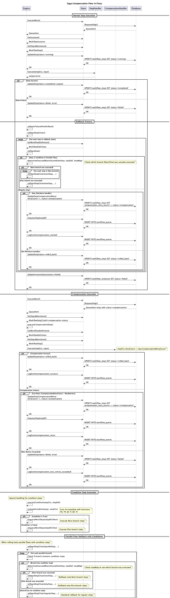
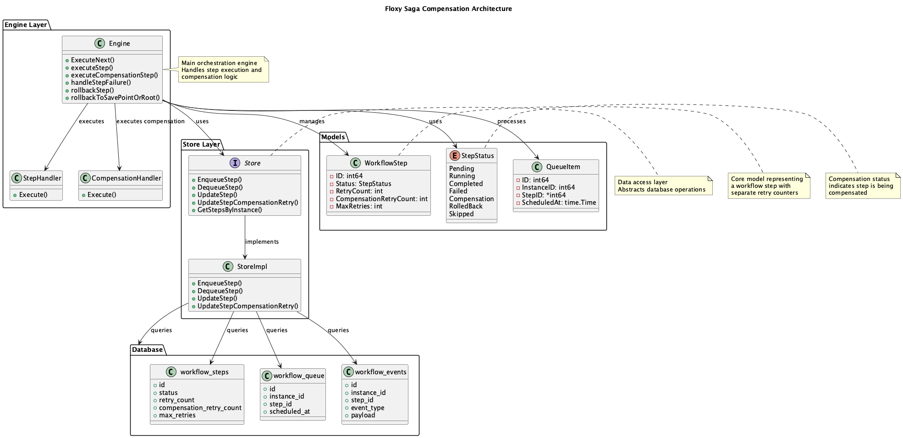

# Saga Compensation Diagrams

This document contains PlantUML diagrams describing the saga compensation mechanism in the Floxy library.

## Sequence Diagram

Shows the step-by-step execution of the compensation process:

  

## State Diagram

Shows the transitions between step states:

  

## Architecture Diagram

Shows system components and their interactions:

  

## Key Features

### Separate Retry Counters
- `RetryCount` - for normal step execution attempts
- `CompensationRetryCount` - for compensation attempts

### Step Statuses
- `StepStatusCompensation` - step is being compensated
- `StepStatusRolledBack` - step successfully rolled back
- `StepStatusFailed` - compensation exhausted all attempts

### Compensation Logic
1. On step failure, rollback process is initiated
2. If OnFailure handler exists, step is marked as Compensation
3. Compensation executes with retry logic
4. On success, step is marked as RolledBack
5. On failure - retry attempt or final Failed status
